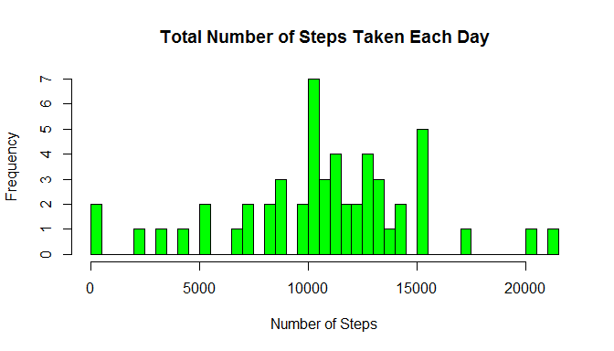
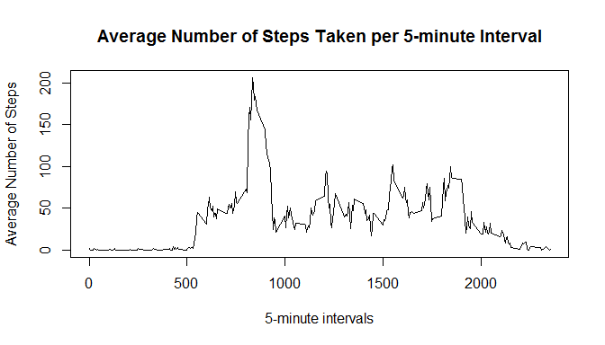
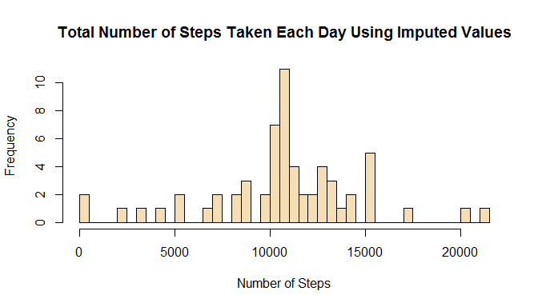
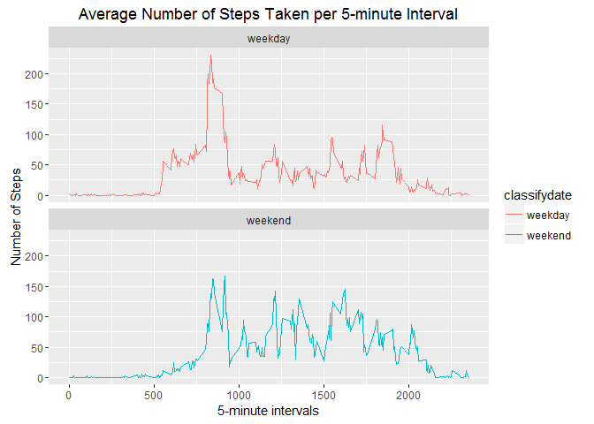

# Reproducible Research: Peer Assessment Course Project 1 Submitted by: Ann Bessenbacher


## Loading and preprocessing the data
### Load libraries (Note: warnings and messages are supressed here)

```r
library(ggplot2)
library(dplyr)
library(lubridate)
```
### Clean the R envinroment, load and process data

```r
rm(list=ls())

activity <- read.csv("activity.csv")

activity$date <- ymd(activity$date)
```
## What is total number of steps taken per day?
### Calculate total steps taken per day

```r
stepsbyday <- activity %>%
              group_by(date) %>%
              summarize(sum(steps))
```
### Plot histogram of number of steps taken per day

```r
hist(stepsbyday$`sum(steps)`, xlab="Number of Steps", ylab="Frequency", main="Total Number of Steps Taken Each Day", col="green", breaks=50)
```

<!-- -->

## Calculate the mean and median number of steps taken per day

```r
meansteps <- mean(stepsbyday$`sum(steps)`, na.rm=TRUE)
mediansteps <- median(stepsbyday$`sum(steps)`, na.rm=TRUE)
```
The mean number of steps taken per day is: 1.0766189\times 10^{4}.  
The median number of steps taken per day is: 10765.

## What is the average daily activity pattern?
### Calculate the mean number of steps per interval across time period and create time series plot

```r
stepsbyinterval <- activity %>%
              group_by(interval) %>%
              summarize(mean(steps, na.rm=TRUE))

names(stepsbyinterval) <- c("interval", "steps")
plot(stepsbyinterval$interval, stepsbyinterval$steps, type="l", xlab='5-minute intervals', ylab='Average Number of Steps', main='Average Number of Steps Taken per 5-minute Interval' )
```

<!-- -->

```r
maxInterval <- stepsbyinterval$interval[which.max(stepsbyinterval$steps)]
```
Interval 835 is the interval that contains the maximum number of steps on average across all days.

## Imputing missing values
### count number of missing values

```r
missingValues <- sum(!complete.cases(activity))
```
There are 2304 rows with missing values in the Activity dataset.

### Replacing missing step values with the mean value for that interval across all days that was previously computed and stored in the stepsbyinterval dataframe

```r
actlen <- length(activity$steps)
imputedActivity <- activity
i=1

for (i in seq_len(actlen)){

  if(is.na(activity$steps[i]))
  {
    intervalpick <- which(stepsbyinterval[,1]==activity$interval[i])
    imputedActivity$steps[i] <- stepsbyinterval$steps[intervalpick]
  }
}
```
### Calculate total steps taken per day with imputed values

```r
stepsbydayI <- imputedActivity %>%
              group_by(date) %>%
              summarize(sum(steps))
```
### Plot histogram of number of steps taken per day with imputed values

```r
hist(stepsbydayI$`sum(steps)`, xlab="Number of Steps", ylab="Frequency", main="Total Number of Steps Taken Each Day Using Imputed Values", col="wheat", breaks=50)
```

<!-- -->

## Calculate the mean and median number of steps taken per day with imputed values

```r
meanstepsImp <- mean(stepsbydayI$`sum(steps)`, na.rm=TRUE)
medianstepsImp <- median(stepsbydayI$`sum(steps)`, na.rm=TRUE)

diffmean <- meanstepsImp-meansteps
diffmedian <- medianstepsImp-mediansteps
```

The mean number of steps taken per day using imputed values is: 1.0766189\times 10^{4}.  
The median number of steps taken per day using imputed values is: 1.0766189\times 10^{4}.

The difference between the original mean and the mean calculated with imputed values is: 0.  This is expected because the mean value for each interval was use to impute missing values.

The difference between the original median and the median calculated with imputed values is: 1.1886792.  The difference here is very small because the mean value for each interval was used to impute the missing values.

## Are there differences in activity patterns between weekdays and weekends?
### Create a new factor variable to classify each day as weekday or weekend

```r
imputedActivity <- mutate(imputedActivity, classifydate = ifelse(wday(date) %in% c(1,7), 'weekend', 'weekday'))
```
### Calculate the mean number of steps per interval across time period and create time series plot

```r
stepsbyintervalImputed <- imputedActivity %>%
                 group_by(interval, classifydate) %>%
                 summarize(mean(steps, na.rm=TRUE))

names(stepsbyintervalImputed) <- c("interval", "classifydate", "steps")
p<- ggplot(stepsbyintervalImputed, aes(interval, steps, color=classifydate)) + 
      geom_line() + labs(x = '5-minute intervals', y='Number of Steps', title="Average Number of Steps Taken per 5-minute Interval") + 
      facet_wrap(~ classifydate, ncol = 1, nrow=2)
print(p)
```

<!-- -->
